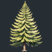
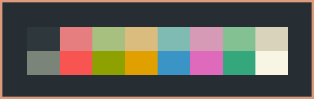
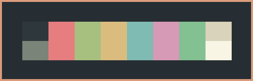
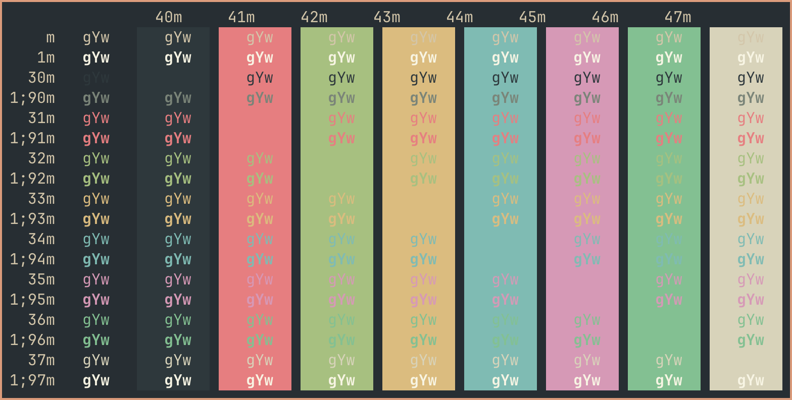

# Everforest iTerm
The Everforest color scheme for iTerm2.

 

* [iTerm2 for macOS](https://iterm2.com/)

* [Everforest color scheme](https://github.com/sainnhe/everforest)

* [Everforest website](https://everforest.vercel.app/)

* [Everforest for Starship](https://github.com/martelo11/starship-everforest-themes) 

*Everforest.itermcolors*

 

 

*Everforest 2.itermcolors (without alternative colors for bold text)*

 

